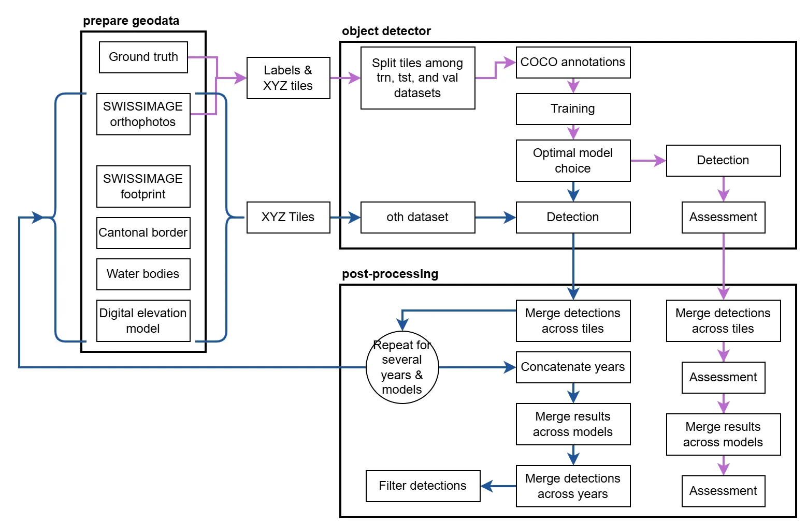

# Automatic detection of agricultural soils degraded by anthropogenic activities

The aim of the project is to automatically detect anthropogenic activities that have degraded agricultural soils in the past. Two main categories have been defined: "non-agricultural activity" and "land movement". The results will make it possible to identify potentially rehabilitable soils that can be used to establish a land crop rotation map. <br>
This project was developed in collaboration with the Canton of Ticino and of the Canton of Vaud. A detailed documentation of the project and results can be found on the [STDL technical website](https://tech.stdl.ch/PROJ-SDA/).

**Table of content**

- [Requirements](#requirements)
    - [Hardware](#hardware)
    - [Software](#software)
    - [Installation](#installation)
- [Getting started](#getting-started)
    - [Files structure](#files-structure)
    - [Data](#data)
    - [Scripts](#scripts)
    - [Workflow instructions](#workflow-instructions)
- [Disclaimer](#disclaimer)


## Requirements

### Hardware

The project has been run on a 32 GiB RAM machine with a 16 GiB GPU (NVIDIA Tesla T4) compatible with [CUDA](https://detectron2.readthedocs.io/en/latest/tutorials/install.html). 


### Software

- Ubuntu 20.04
- Python 3.8 
- PyTorch 1.10
- CUDA 11.3
- GDAL 3.0.4
- object-detector [2.3.2](https://github.com/swiss-territorial-data-lab/object-detector/releases/tag/v2.3.2)

To avoid installation conflicts, we recommend running the process in a Docker container. The steps necessary to the creation of the Docker image are described in the next section.

### Installation

Install GDAL and OpenCV:

```
sudo apt-get install -y python3-gdal gdal-bin libgdal-dev gcc g++ python3.8-dev
sudo apt-get install -y python3-opencv
```

#### With docker

The installation is performed from this folder with the following steps:

* The dockerfile of this project supposes the existence on the machine of an image called `object-detector-stdl-objdet`. 
    * You can control the image existence by listing the available images with `docker images ls`. If it does not exist:
        * Clone the [STDL object detector](https://github.com/swiss-territorial-data-lab/object-detector),
        * Get into the `object-detector` folder,
        * Build the image for the object detector with `docker compose build`.
        * You can control the installation by running `docker compose run --rm stdl-objdet stdl-objdet -h`.
* Go back to the folder `proj-sda`,
* Build docker,
* Run docker,
* Go to `proj-sda` directory in docker.

The corresponding command lines are

```
docker images ls
git clone https://github.com/swiss-territorial-data-lab/object-detector.git
cd object-detector
docker compose build
cd -
docker compose build
docker compose run --rm sda
cd proj-sda            # Command to run in the docker bash
```


#### Without docker

Python dependencies can be installed with `pip` or `conda` using the `requirements.txt` file provided. We advise using a [Python virtual environment](https://docs.python.org/3/library/venv.html).

- Create a Python virtual environment
```
$ python3.8 -m venv <dir_path>/<name of the virtual environment>
$ source <dir_path>/<name of the virtual environment>/bin/activate
```

- Install dependencies
```
$ pip install -r requirements.txt
```

- `requirements.txt` has been obtained by compiling `requirements.in`. Recompiling the file might lead to libraries version changes:
```
$ pip-compile requirements.in
```

## Getting started

### Files structure

The project `proj-sda` (in combination with the `object-detector`) is organised as follows. Path names and values can be customised by the user:

<pre>.
├── config                                          # folder containing the configuration files
│   ├── config_det.template.yaml                    # detection workflow template
│   ├── config_det.yaml                             # detection workflow
│   ├── config_sandbox.yaml                         # sandbox scripts
│   ├── config_trne.yaml                            # training and evaluation workflow
│   └── detectron2_config.yaml                      # detectron 2
├── data                                            # folder containing the input data
│   ├── AoI                                         # available on request
│   ├── DEM
│   ├── FP
│   ├── ground_truth                                                             
│   ├── layers                                      # available on request 
│   └── categories_ids.json                         # class dictionary     
├── functions                                       # folder containing the function scripts           
├── images                                          # readme images                                 
├── models                                          # folder containing the trained models
├── output                                          # folder containing the outputs
│   ├── det                            
│   └── trne
├── sandbox                                         # folder containing the scripts tested to improve the results without conclusive results
├── scripts                                         # folder containing the scripts of the workflow described in the "scripts" section 
├── .gitignore                                      
├── LICENSE
├── README.md                                      
├── requirements.in                                 # list of python libraries required for the project
└── requirements.txt                                # python dependencies compiled from requirements.in file
</pre>


## Data

Below, the description of input data used for this project. 

- images: [_SWISSIMAGE Journey_](https://map.geo.admin.ch/#/map?lang=fr&center=2660000,1190000&z=1&bgLayer=ch.swisstopo.pixelkarte-farbe&topic=ech&layers=ch.swisstopo.swissimage-product@year=2024;ch.swisstopo.swissimage-product.metadata@year=2024) is an annual dataset of aerial images of Switzerland from 1946 to today. The images are downloaded from the [geo.admin.ch](https://www.geo.admin.ch/fr) server using [XYZ](https://api3.geo.admin.ch/services/sdiservices.html#xyz) connector. 
- area of interest (AoI):
    - swissimage footprints: image acquisition footprints by year (swissimage_footprint_*.shp) can be [consulted online](https://map.geo.admin.ch/#/map?lang=fr&center=2660000,1190000&z=1&bgLayer=ch.swisstopo.pixelkarte-farbe&topic=ech&layers=ch.swisstopo.zeitreihen@year=1864,f;ch.bfs.gebaeude_wohnungs_register,f;ch.bav.haltestellen-oev,f;ch.swisstopo.swisstlm3d-wanderwege,f;ch.astra.wanderland-sperrungen_umleitungen,f;ch.swisstopo.swissimage-product@year=2021;ch.swisstopo.swissimage-product.metadata@year=2021&timeSlider=2021) and downloaded from the [relevant geocat page](https://www.geocat.ch/geonetwork/srv/fre/catalog.search#/metadata/1fc43fd9-f43f-4779-aa59-51e8f4833372). The files are to be placed in the folder `data/AoI/swissimage_footprint`. A bash file is available to download and unzip the data: `scripts/get_swissimage_footprint.sh`.
- ground truth: labels vectorised by the domain experts. <br>
**Disclaimer:** the ground truth dataset is unofficial and has been produced specifically for the purposes of this project.
- water layer: water bodies over which no tiles should be produced. They are available in the folder `data/layers/<canton>/`.
- digital elevation model: raster mosaic of the Swiss DEM downloaded from [GitHub](https://github.com/lukasmartinelli/swissdem). A bash file is available to download the data: `scripts/get_dem.sh`. It is used to limit the height of the considered tiles and filter the detections at the end, based on the requirements of the domain experts.
- layers: list of vector layers provided by the domain experts to spatially intersect with the results to either exclude detections or to add intersection information in the final attribute table. The data is available on the cantonal geoportals ([Ticino](https://www4.ti.ch/dt/sg/sai/ugeo/temi/geoportale-ticino/geoportale/geodati) and [Vaud](https://www.geo.vd.ch/)) or are available on request.
- category_ids.json: correspondence between category names, supercategories and ids.
- models: the trained models used to produce the results presented in the documentation are available on request.

## Scripts

The `proj-sda` repository contains scripts to prepare and post-process the data and results. Hereafter a short description of each script and a workflow graph:

<p align="center">

<br />
</p>

0. `get_dem.sh` & `get_swissimage_footprint.sh`: download the Swiss DEM and the SWISSIMAGE footprints.
1. `prepare_aoi.py`: produce an AOI shapefile compatible with a SWISSIMAGE year and desired geographical boundaries.
2. `prepare_data.py`: format labels and produce tiles to be processed in the OD.
3. `results_analysis.py`: plot some parameters of the detections to help understand the results (optional).
4. `merge_detections.py`: merge adjacent detections cut by tiles into a single detection and attribute the class based on the largest area.
5. `compile_years.py`: merge all the detection layers obtained during inference by year.
6. `merge_multi_results.py`: merge the results from different models into one dataset of selected detections.
7. `merge_across_years`: dissolve overlapping detections of different years.
6. `filter_detections.py`: filter detections by overlap with other vector layers. The overlapping portion of the detection can be removed or a new attribute is created to indicate the overlapping ratio with the layer of interest. Other information such as score, elevation, or slope are also displayed.
7. `batch_process.sh`: batch script to perform the inference workflow over several years with one model.
8. `batch_process_multi_models.sh`: batch script to perform the inference workflow over several years with several models.

Object detection is performed with tools present in the [`object-detector`](https://github.com/swiss-territorial-data-lab/object-detector) git repository. 


## Workflow instructions

The workflow can be executed by running the following list of actions and commands. Adjust the paths and input values of the configuration files accordingly. The contents of the configuration files in square brackets must be assigned. 

**Training and evaluation**: 

Prepare the data:
```
$ scripts/get_dem.sh
$ python scripts/prepare_data.py config/config_trne.yaml
$ stdl-objdet generate_tilesets config/config_trne.yaml
```

Train the model:
```
$ stdl-objdet train_model config/config_trne.yaml
$ tensorboard --logdir output/trne/logs
```

Open the following link with a web browser: `http://localhost:6006` and identify the iteration minimising the validation loss and select the model accordingly (`model_*.pth`) in `config_trne`. For the provided parameters, `model_0002999.pth` is the default one.

Perform and assess detections:
```
$ stdl-objdet make_detections config/config_trne.yaml
$ stdl-objdet assess_detections config/config_trne.yaml
```

Some characteristics of the detections can be analysed with the help of plots:
```
$ python scripts/result_analysis.py config/config_trne.yaml
```

The detection obtained by tiles can be merged when adjacent and a new assessment is performed:
```
$ python scripts/merge_detections.py config/config_trne.yaml
```

Optionally, the workflow can be run with several models and the results merged in order to improve recall.
```
$ python scripts/merge_multi_results.py config/config_trne.yaml
```

Finally, the results for each year can be dissolved into a single detection with a first and last year.
```
$ python scripts/merge_across_years.py config/config_trne.yaml
```

**Inference**: 

Colour processing on images can be performed if needed prior to inference with scripts available in the [sandbox](#sandbox) folder. 

Copy the selected trained model to the folder `models`:
```
$ mkdir models
$ cp output/trne/logs/<selected_model_pth> models
```

Process images:
```
$ scripts/get_dem.sh
$ scripts/get_swissimage_footprint.sh
$ python scripts/prepare_aoi.py config/config_det.yaml
$ python scripts/prepare_data.py config/config_det.yaml
$ stdl-objdet generate_tilesets config/config_det.yaml
$ stdl-objdet make_detections config/config_det.yaml
$ python scripts/merge_detections.py config/config_det.yaml
```

If the previous part is run with several models, the results can be merged:
```
$ python scripts/merge_multi_results.py config/config_det.yaml
```

Apply the final filter:
```
$ python scripts/filter_detections.py config/config_det.yaml
```

The inference workflow has been automated and can be run for a batch of years (to be specified in the script) by executing these commands:
```
$ scripts/get_dem.sh
$ scripts/batch_process.sh
```

It can also be run automatically for several models (to be specified in the script) by executing these commands:
```
$ scripts/get_dem.sh
$ scripts/get_swissimage_footprint.sh
$ scripts/batch_process_multi_models.sh
```

## Sandbox

Additional scripts can be used to process images. Their use is optional.

1. `clip.py`: clip a vector layer with another one.
2. `gt_analysis.py`: plot GT characteristics.
3. `match_colour.py`: normalise the colour histogram to the one of a reference image. 
4. `mosaic.py`: mosaic images. 
5. `rgb_to_greyscale.py`: convert RGB images to greyscale images with rasterio. 
6. `rgb_to_greyscale.sh`: convert RGB images to greyscale images with GDAL. 
7. `tiff2geotiff.py`: convert tiff to geotiff files.

This project uses a multi-year dataset comprising greyscale and RGB images. The method developed by [Farella et al. 2022](https://doi.org/10.3390/jimaging8100269), for which the code is available [here](https://github.com/3DOM-FBK/Hyper_U_Net), was also tested for the colourisation of the historical greyscale images


## Disclaimer

Depending on the end purpose, we strongly recommend users not take for granted the detections obtained through this code. Indeed, results can exhibit false positives and false negatives, as is the case in all approaches based on deep learning.
